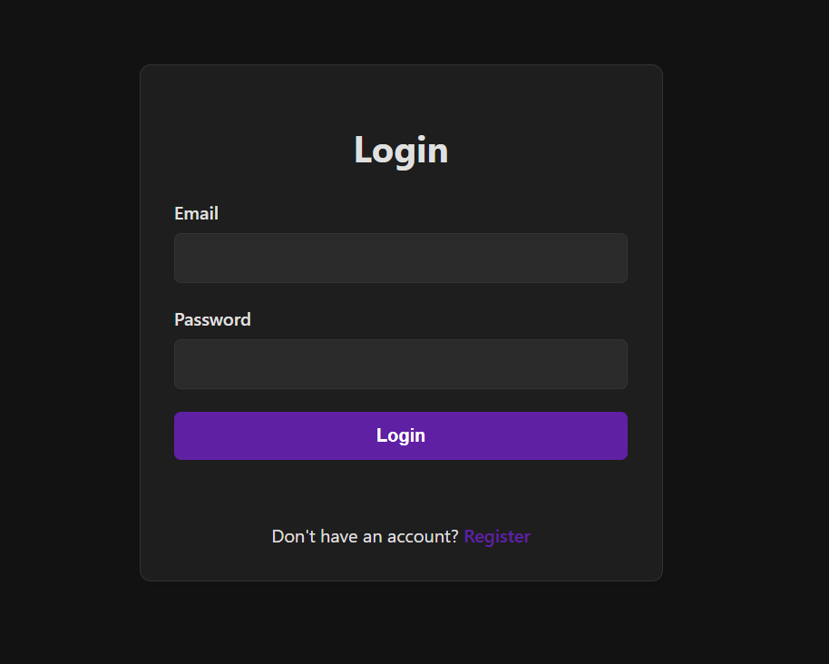
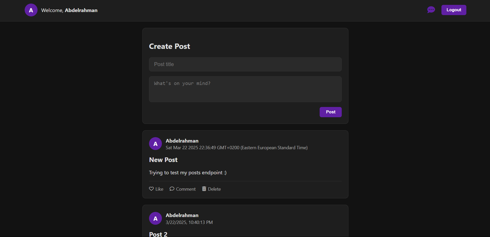
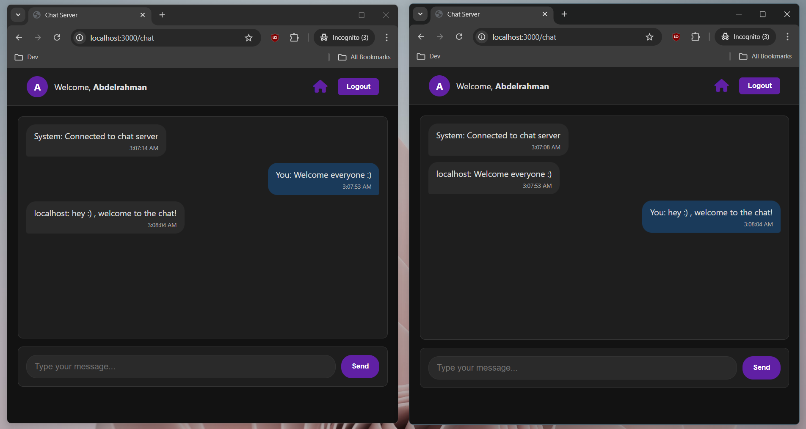

# WebSocket Chat Application

A real-time chat application built with Node.js, Express, MongoDB, and WebSocket technology featuring authentication and post creation.

## ✨ Features

- 🔒 JWT Authentication (Register/Login/Logout)
- 💬 Real-time chat using WebSocket
- 📝 Create and view posts
- 🍪 Cookie-based sessions
- 🗃️ MongoDB data persistence
- 📱 Responsive UI

## 🛠️ Tech Stack

**Frontend:**  

**Backend:**  

**Database:**  

**Other:**  

## 🖼️ UI Examples

### Login Page

### Register Page

### Posts Feed

### Chat Interface

